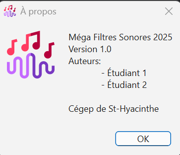
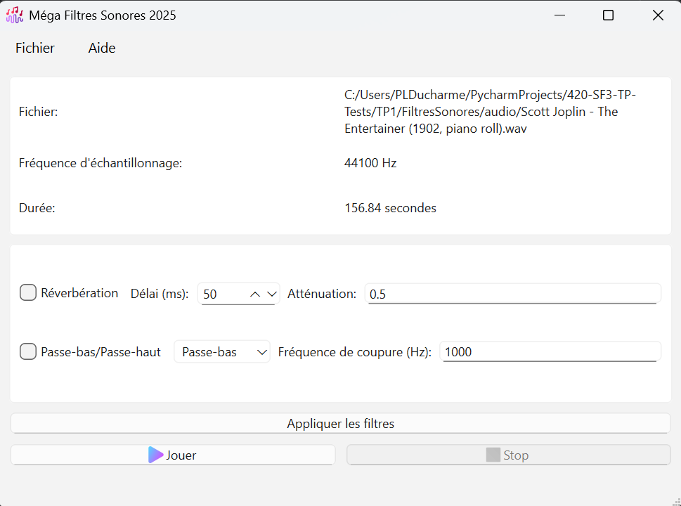

# Travail Pratique 1: Méga Filtres Sonores 2025

Parmi les domaines d'application de l'étude de la physique des ondes, le traitement du son occupe une place importante.
Que ce soit pour améliorer la qualité audio dans les systèmes de sonorisation, pour créer des effets sonores dans
la musique ou pour analyser des signaux acoustiques, les filtres sonores jouent un rôle crucial. 
Dans ce travail pratique, nous allons explorer l'application de filtres sonores à l'aide de Python et des bibliothèques
PySide6, NumPy, SciPy et SoundDevice.

## Comprendre un fichier WAV
Un fichier WAV (Waveform Audio File Format) est un format de fichier audio standard utilisé pour stocker des données audio
non compressées. Il est largement utilisé pour la qualité audio élevée et la simplicité de son format. Un fichier WAV contient
des informations sur le format audio, telles que la fréquence d'échantillonnage, le nombre de canaux (mono ou stéréo), et la profondeur
de bits (par exemple, 16 bits ou 24 bits). Les données audio elles-mêmes sont stockées sous forme d'échantillons PCM (Pulse Code Modulation).
Ces échantillons représentent l'amplitude du signal audio à des intervalles de temps réguliers.

La fréquence d'échantillonnage (sampling rate) est un paramètre clé dans les fichiers WAV, car elle détermine combien de fois par seconde
le signal audio est mesuré. Par exemple, une fréquence d'échantillonnage de 44100 Hz signifie que le signal est échantillonné 44100 fois par seconde.

### Lire un fichier WAV
Pour lire les données de signaux d'un fichier WAV en Python, nous utiliserons la bibliothèque `scipy.io.wavfile`.

La fonction `wavfile.read()` permet de lire un fichier WAV et de retourner la fréquence d'échantillonnage et les données audio (signal) sous forme de tableau NumPy.

Pour la lecture audio, nous utiliserons la bibliothèque `sounddevice`, qui permet de jouer des signaux audio directement à partir de tableaux NumPy.
- La fonction `sd.play(signal_modifie, frequence_d_echantillonage)` permet de jouer un signal audio, et `sd.stop()` permet d'arrêter la lecture.

## Prérequis
- Créer un environnement virtuel Python
- Installer les bibliothèques nécessaires:
  - PySide6
  - NumPy
  - SciPy
  - SoundDevice
- Écrire vos noms et utilisateurs github dans la section en haut du fichier `lecteur_audio.py`
- À faire en équipe de 2 ou 3 personnes
  - Tout travail solo sera refusé et se verra attribuer la note de 0.

## Travail à réaliser
Vous devez réaliser une application graphique avec PySide6 qui permet de:
1. Charger et lire un fichier audio (format WAV).
2. Afficher les informations de base du fichier audio (durée, fréquence d'échantillonnage, nom du fichier).
3. Appliquer différents filtres sonores sur le son du fichier audio
   - Réverbération
   - Passe-bas
   - Passe-haut
4. Permettre à l'utilisateur de jouer le fichier audio avec ou sans les filtres appliqués.

## Requis fonctionnels

### Interrface utilisateur
- Application graphique avec PySide6
- Le titre de la fenêtre doit être ``Méga Filtres Sonores 2025``
- La fenêtre doit utiliser l'icône ``music-wave.png``
- Un menu ``Fichier``
  - avec une action ``Ouvrir`` pour charger un fichier audio
    - Doit utiliser un QFileDialog pour sélectionner le fichier
    - Doit afficher l'icône du ``dossier.png``
  - avec un séparateur
  - avec une action ``Quitter`` pour fermer l'application
- Un menu ``Aide``
  - avec une action ``À propos`` pour afficher une boîte de dialogue avec les informations sur l'application
    - Vous pouvez utiliser le QMessageBox.about()
    - Contenant les inforamtions suivantes:
      - Méga Filtres Sonores 2025
      - Version: 1.0
      - Auteurs: Vos noms
      - Cégep de St-Hyacinthe
    - ex: 

- Une section qui contiendra les informations du fichier audio chargé
  - Nom du fichier
  - Durée (en secondes)
  - Fréquence d'échantillonnage (en Hz)
  - Exemple: 
  - Chaque ligne doit utiliser deux QLabel
    - Un pour le titre (ex: ``Nom du fichier:``)
    - Un pour la valeur (ex: ``monfichier.wav``)
    - pour les aligner, vous pouvez utiliser un QHBoxLayout pour chaque ligne

- Une section pour les filtres à appliquer
    - Sur une ligne, un QCheckBox pour le filtre de réverbération
      - Un QLabel et un QSpinBox pour régler le délai de réverbération (minimum 0, maximum 1500, valeur par défaut 50)
      - Un QLabel et un QLineEdit pour régler l'atténuation de la réverbération (minimum 0.0, maximum 1.0, valeur par défaut 0.5)
        - Il vous est permis d'utiliser un QSpinBox au lieu d'un QLineEdit pour l'atténuation.
      - pour les aligner, vous pouvez utiliser un QHBoxLayout pour chaque ligne
    - Sur une ligne, un QCheckBox pour les filtre passe-bas et pass-haut
      - Un QComboBox pour choisir entre passe-bas et passe-haut
      - Un QLabel et un QLineEdit pour régler la fréquence de coupure (en Hz, valeur par défaut 1000)
      - pour les aligner, vous pouvez utiliser un QHBoxLayout pour chaque ligne

- Un bouton pour appliquer les filtres
  - Lorsque cliqué, les filtres sélectionnés doivent être appliqués au signal audio
  - Voir la section ``Application de filtres``

- Une section pour le contrôle de la lecture
    - Un bouton pour démarrer la lecture
      - Doit utiliser l'icône ``play.png``
      - Lorsque cliqué, la lecture du fichier audio avec les filtres appliqués doit démarrer
      - Une fois la lecture démarrée, le bouton doit être désactivé et le bouton d'arrêt doit être activé
    - Un bouton pour arrêter la lecture
      - Doit utiliser l'icône ``stop.png``
      - Lorsque cliqué, la lecture du fichier audio doit s'arrêter
      - Une fois la lecture arrêtée, le bouton doit être désactivé et le bouton de lecture doit être activé
    - Pour les aligner, vous pouvez utiliser un QHBoxLayout

- Une barre de statut
  - Doit afficher une barre de progression pendant l'application des filtres
    - La barre augmentera pour chaque filtre appliqué

### Filtres sonores
Les filtres seront implémenters dans un fichier séparé `filtres.py`.
Chaque filtre hérite de la classe abstraite ``AbstractFiltre`` qui contient une méthode abstraite ``def filtrer(self, signal: list[float], frequence: int) -> list[float]:``

Les notions de numpy seront revues en classe à la semaine 5

#### Réverbération
La réverbération est un effet sonore qui simule la réflexion du son dans un espace.

Nous utiliserons des tableaux numpy (matrices) pour appliquer la réverbération au signal audio.

Voici le pseudo code pour le filtre de réverbération:
```
Créer une copie du signal original en le transformant en tableau numpy
Séparer le signal entre le canal gauche et le canal droit (si stéréo) pour obtenir deux tableaux numpy 1D
Pour chaque canal:
    Initialiser un tableau numpy de zéros de taille (signal + le délai de réverbération)
    Ajouter le signal original au début du tableau
    Ajouter le signal retardé multiplié par l'atténuation au tableau à partir de l'index du délai
Combiner les deux canaux en un seul tableau numpy 2D (si stéréo)
Retourner le signal réverbéré sous forme de liste
```

#### Passe-bas et passe-haut
Les filtres passe-bas et passe-haut sont utilisés pour atténuer les fréquences au-dessus ou en dessous d'une certaine fréquence de coupure.

En gros, un filtre passe-bas laisse passer les basses fréquences et atténue les hautes fréquences, tandis qu'un filtre passe-haut fait l'inverse.

Voici le pseudo code pour les filtres passe-bas et passe-haut:
```
Créer une copie du signal original en le transformant en tableau numpy
Séparer le signal entre le canal gauche et le canal droit (si stéréo) pour obtenir deux tableaux numpy 1D
Initialser la longueur de réponse impulsionnelle (N) à 101
Calculer la fréquence de coupure normalisée (fc) en divisant la fréquence de coupure par la moitié de la fréquence d'échantillonnage
Créer la fenêtre de sinc pour le filtre passe-bas
    h = np.sinc(2 * fc * (np.arange(N) - (N - 1) / 2)) 
Appliquer la fenêtre de Hamming de taille longueur de réponse impulsionnelle en multipliant h par np.hamming(N)
Normaliser le filtre en divisant h par la somme de h

Si le filtre est passe-haut, inverser le filtre en soustrayant chaque élément de h de 1:
    h = -h
    h[(N - 1) // 2] += 1

Pour le canal gauche et le canal droit (si stéréo):
    Appliquer la convolution entre le signal et le filtre h en utilisant np.convolve avec le mode 'same'
Combiner les deux canaux en un seul tableau numpy 2D (si stéréo)
Retourner le signal filtré sous forme de liste
```

### Application de filtres
Pour appliquer un filtre sur un signal, vous devrez d'abord constituer une liste de filtres à appliquer.  Pour ce faire,
 vous devez connecter le bouton "Appliquer filtres" à une méthode de votre contrôleur. Cette méthode doit vérifier les
filtres sélectionnés dans l'interface et les initialiser (appeler le constructeur du filtre). Les filtres possèdent deux
attributs:
- nom: Le nom du filtre, pas utilisé par l'interface en ce moment
- paramètres: un dictionnaire pouvant contenir n'importe quelles paires de clé-valeur nécessaire au filtre (ex: fréquence de coupure)
Une fois initialisé et ajouté à la liste, vous pourrez appeler la méthode fournie ``appliquer_filtres()``. Comme chaque 
filtre hérite de AbstractFiltre, ils possèdent tous une méthode filtrer() qui contient la logique du filtre. La boucle va les
appliquer le filtre en utilisant le résultat du filtre précédent (ou le signal source pour le premier).

## Évaluation
- Interface utilisateur (70%)
- Fonctionnalité des filtres (30%)
- Bonus (5%): Ajouter un spectrogramme du signal audio dans l'interface utilisateur
  - Vous pouvez utiliser la bibliothèque `matplotlib` pour afficher le spectrogramme

Des points seront retirés pour:
- Code non commenté
- Non-respect des consignes
- PEP-008 non respecté
- Non-respect des conventions de nommage

Les dispositions (layouts) ne sont pas proprement évaluées, mais une interface bien organisée et agréable à utiliser le sera.

### Bugs
- Si votre équipe est la première à rapporter un bug, vous obtiendrez 5% de bonus sur la note du travail (max 5%)

